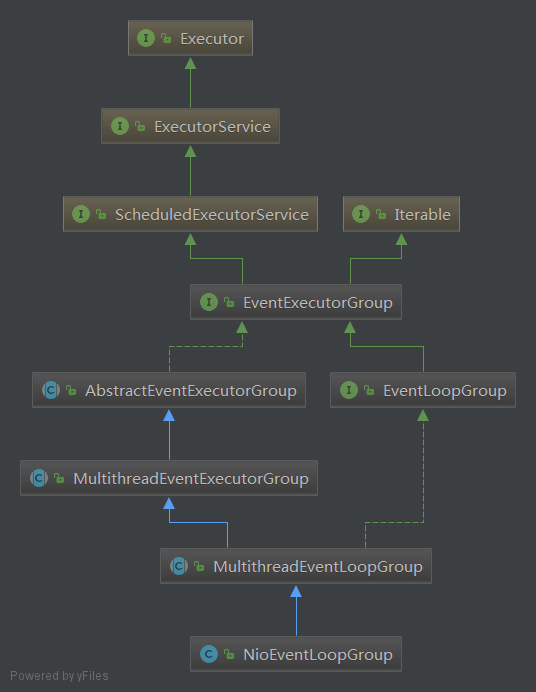

# IO和NIO的基础知识

# 项目简介
这个是在https://github.com/netty/netty下载的4.1版本的zip包，在idea使用maven编译打包的时候会出现构建错误，
使用去除checkstyle方式进行编译，如下
clean package -Dmaven.test.skip=true -Dcheckstyle.skip=true

然后运行example模块的EchoServer，能正常运行不报错说明源码环境搭建成功

Netty是一个基于NIO的基于事件的高性能网络框架，在NIO里面，比较和核心的三个内容分别是Channel、Buffer、Selector，Channel负责网络数据传输，而
Buffer则存储数据，Buffer可以从Channel中获取到数据，也可以向Channel里面写入数据，Selector可以监听多个Channel的事件，当发生某种事件的时候可以
发出通知。
备注：【channel的作用和socket类似】

# 服务端启动全过程

结论：
Netty 服务端启动和交互的逻辑的底层实现是借助于Java NIO ServerSocketChannel来实现，Java NIO ServerSocketChannel作为服务端的绑定端口、
接受客户端的连接的样式代码如下：

        /*
         * 既然是服务器端，肯定需要一个ServerSocketChannel来监听新进来的TCP连接。
         * */
        ServerSocketChannel serverSocketChannel = ServerSocketChannel.open();
        //监听指定的端口号
        serverSocketChannel.socket().bind(new InetSocketAddress(9999));

        //检测是否有客户端连接进来
        while(true){
            SocketChannel socketChannel = serverSocketChannel.accept();
            //do  something....
        }
        //在使用完毕后，会进行关闭
        serverSocketChannel.close();

## NioEventLoopGroup
其实是一个线程池的封装

ChannelFactory 和 Channel 类型的确定
除了 TCP 协议以外, Netty 还支持很多其他的连接协议, 并且每种协议还有 NIO(异步 IO) 和 OIO(Old-IO, 即传统的阻塞 IO) 版本的区别. 
不同协议不同的阻塞类型的连接都有不同的 Channel 类型与之对应下面是一些常用的 Channel 类型:
- NioSocketChannel, 代表异步的客户端 TCP Socket 连接.
- NioServerSocketChannel, 异步的服务器端 TCP Socket 连接.
- NioDatagramChannel, 异步的 UDP 连接
- NioSctpChannel, 异步的客户端 Sctp 连接.
- NioSctpServerChannel, 异步的 Sctp 服务器端连接.
- OioSocketChannel, 同步的客户端 TCP Socket 连接.
- OioServerSocketChannel, 同步的服务器端 TCP Socket 连接.
- OioDatagramChannel, 同步的 UDP 连接
- OioSctpChannel, 同步的 Sctp 服务器端连接.
- OioSctpServerChannel, 同步的客户端 TCP Socket 连接.

# Netty架构设计
https://www.cnblogs.com/DaTouDaddy/p/6801906.html

读完这一章，我们基本上可以了解到Netty所有重要的组件，对Netty有一个全面的认识，这对下一步深入学习Netty是十分重要的，而学完这一章，我们其实已经可以用Netty解决一些常规的问题了。

 
一、Netty都有哪些组件？
Bootstrap or ServerBootstrap
EventLoop
EventLoopGroup
ChannelPipeline
Channel
Future or ChannelFuture
ChannelInitializer
ChannelHandler

Bootstrap，一个Netty应用通常由一个Bootstrap开始，它主要作用是配置整个Netty程序，串联起各个组件。
Handler，为了支持各种协议和处理数据的方式，便诞生了Handler组件。Handler主要用来处理各种事件，这里的事件很广泛，比如可以是连接、数据接收、异常、数据转换等。
ChannelInboundHandler，一个最常用的Handler。这个Handler的作用就是处理接收到数据时的事件，也就是说，我们的业务逻辑一般就是写在这个Handler里面的，ChannelInboundHandler就是用来处理我们的核心业务逻辑。
ChannelInitializer，当一个链接建立时，我们需要知道怎么来接收或者发送数据，当然，我们有各种各样的Handler实现来处理它，那么ChannelInitializer便是用来配置这些Handler，它会提供一个ChannelPipeline，并把Handler加入到ChannelPipeline。
ChannelPipeline，一个Netty应用基于ChannelPipeline机制，这种机制需要依赖于EventLoop和EventLoopGroup，因为它们三个都和事件或者事件处理相关。
EventLoops的目的是为Channel处理IO操作，一个EventLoop可以为多个Channel服务。
EventLoopGroup会包含多个EventLoop。
Channel代表了一个Socket链接，或者其它和IO操作相关的组件，它和EventLoop一起用来参与IO处理。
Future，在Netty中所有的IO操作都是异步的，因此，你不能立刻得知消息是否被正确处理，但是我们可以过一会等它执行完成或者直接注册一个监听，具体的实现就是通过Future和ChannelFutures,他们可以注册一个监听，当操作执行成功或失败时监听会自动触发。总之，所有的操作都会返回一个ChannelFuture。
 
 
二、Netty是如何处理连接请求和业务逻辑的呢？-- Channels、Events 和 IO
Netty是一个非阻塞的、事件驱动的、网络编程框架。当然，我们很容易理解Netty会用线程来处理IO事件，对于熟悉多线程编程的人来说，你或许会想到如何同步你的代码，
但是Netty不需要我们考虑这些，具体是这样：
一个Channel会对应一个EventLoop，而一个EventLoop会对应着一个线程，也就是说，仅有一个线程在负责一个Channel的IO操作。
关于这些名词之间的关系，可以见下图：
     
如图所示：当一个连接到达，Netty会注册一个channel，然后EventLoopGroup会分配一个EventLoop绑定到这个channel,在这个channel的整个生命周期过程中，
都会由绑定的这个EventLoop来为它服务，而这个EventLoop就是一个线程。
说到这里，那么EventLoops和EventLoopGroups关系是如何的呢？我们前面说过一个EventLoopGroup包含多个Eventloop，但是我们看一下下面这幅图，
这幅图是一个继承树，从这幅图中我们可以看出，EventLoop其实继承自EventloopGroup，也就是说，在某些情况下，我们可以把一个EventLoopGroup当做一个EventLoop来用。

三、我们来看看如何配置一个Netty应用？-- BootsStrapp
 
我们利用BootsStrapping来配置netty 应用，它有两种类型，一种用于Client端：BootsStrap，另一种用于Server端：ServerBootstrap，要想区别如何使用它们，你仅需要记住一个用在Client端，一个用在Server端。下面我们来详细介绍一下这两种类型的区别：
1.第一个最明显的区别是，ServerBootstrap用于Server端，通过调用bind()方法来绑定到一个端口监听连接；Bootstrap用于Client端，需要调用connect()方法来连接服务器端，但我们也可以通过调用bind()方法返回的ChannelFuture中获取Channel去connect服务器端。
2.客户端的Bootstrap一般用一个EventLoopGroup，而服务器端的ServerBootstrap会用到两个（这两个也可以是同一个实例）。
为何服务器端要用到两个EventLoopGroup呢？这么设计有明显的好处，如果一个ServerBootstrap有两个EventLoopGroup，
那么就可以把第一个EventLoopGroup用来专门负责绑定到端口监听连接事件，而把第二个EventLoopGroup用来处理每个接收到的连接，下面我们用一幅图来展现一下这种模式：
       
PS: 如果仅由一个EventLoopGroup处理所有请求和连接的话，在并发量很大的情况下，这个EventLoopGroup有可能会忙于处理已经接收到的连接而不能及时处理新的连接请求，
用两个的话，会有专门的线程来处理连接请求，不会导致请求超时的情况，大大提高了并发处理能力。
我们知道一个Channel需要由一个EventLoop来绑定，而且两者一旦绑定就不会再改变。一般情况下一个EventLoopGroup中的EventLoop数量会少于Channel数量，
那么就很有可能出现一个多个Channel公用一个EventLoop的情况，这就意味着如果一个Channel中的EventLoop很忙的话，会影响到这个Eventloop对其它Channel的处理，
这也就是为什么我们不能阻塞EventLoop的原因。
当然，我们的Server也可以只用一个EventLoopGroup,由一个实例来处理连接请求和IO事件，请看下面这幅图：
 
     
 
 
四、我们看看Netty是如何处理数据的？-- Netty核心ChannelHandler
 
下面我们来看一下netty中是怎样处理数据的，回想一下我们前面讲到的Handler，对了，就是它。说到Handler我们就不得不提ChannelPipeline，
ChannelPipeline负责安排Handler的顺序及其执行，下面我们就来详细介绍一下他们：
 ChannelPipeline and handlers
我们的应用程序中用到的最多的应该就是ChannelHandler，我们可以这么想象，数据在一个ChannelPipeline中流动，而ChannelHandler便是其中的一个个的小阀门，
这些数据都会经过每一个ChannelHandler并且被它处理。这里有一个公共接口ChannelHandler:
 
     
从上图中我们可以看到，ChannelHandler有两个子类ChannelInboundHandler和ChannelOutboundHandler，这两个类对应了两个数据流向，如果数据是从外部流入我们的应用程序，
我们就看做是inbound，相反便是outbound。其实ChannelHandler和Servlet有些类似，一个ChannelHandler处理完接收到的数据会传给下一个Handler，
或者什么不处理，直接传递给下一个。下面我们看一下ChannelPipeline是如何安排ChannelHandler的：
 
     
从上图中我们可以看到，一个ChannelPipeline可以把两种Handler（ChannelInboundHandler和ChannelOutboundHandler）混合在一起，当一个数据流进入ChannelPipeline时，
它会从ChannelPipeline头部开始传给第一个ChannelInboundHandler，当第一个处理完后再传给下一个，一直传递到管道的尾部。与之相对应的是，当数据被写出时，
它会从管道的尾部开始，先经过管道尾部的“最后”一个ChannelOutboundHandler，当它处理完成后会传递给前一个ChannelOutboundHandler。
数据在各个Handler之间传递，这需要调用方法中传递的ChanneHandlerContext来操作，
 在netty的API中提供了两个基类分ChannelOutboundHandlerAdapter和ChannelOutboundHandlerAdapter，他们仅仅实现了调用ChanneHandlerContext来把消息传递给下一个Handler，
 因为我们只关心处理数据，因此我们的程序中可以继承这两个基类来帮助我们做这些，而我们仅需实现处理数据的部分即可。
我们知道InboundHandler和OutboundHandler在ChannelPipeline中是混合在一起的，那么它们如何区分彼此呢？其实很容易，因为它们各自实现的是不同的接口，
对于inbound event，Netty会自动跳过OutboundHandler,相反若是outbound event，ChannelInboundHandler会被忽略掉。
当一个ChannelHandler被加入到ChannelPipeline中时，它便会获得一个ChannelHandlerContext的引用，而ChannelHandlerContext可以用来读写Netty中的数据流。
因此，现在可以有两种方式来发送数据，一种是把数据直接写入Channel，一种是把数据写入ChannelHandlerContext，它们的区别是写入Channel的话，
数据流会从Channel的头开始传递，而如果写入ChannelHandlerContext的话，数据流会流入管道中的下一个Handler。  
 
五、我们最关心的部分，如何处理我们的业务逻辑？ -- Encoders, Decoders and Domain Logic
 
Netty中会有很多Handler，具体是哪种Handler还要看它们继承的是InboundAdapter还是OutboundAdapter。当然，Netty中还提供了一些列的Adapter来帮助我们简化开发，
我们知道在Channelpipeline中每一个Handler都负责把Event传递给下一个Handler，如果有了这些辅助Adapter，这些额外的工作都可自动完成，
我们只需覆盖实现我们真正关心的部分即可。此外，还有一些Adapter会提供一些额外的功能，比如编码和解码。那么下面我们就来看一下其中的三种常用的ChannelHandler：
Encoders和Decoders
     因为我们在网络传输时只能传输字节流，因此，才发送数据之前，我们必须把我们的message型转换为bytes，与之对应，我们在接收数据后，
     必须把接收到的bytes再转换成message。我们把bytes to message这个过程称作Decode(解码成我们可以理解的)，把message to bytes这个过程成为Encode。
     Netty中提供了很多现成的编码/解码器，我们一般从他们的名字中便可知道他们的用途，如ByteToMessageDecoder、MessageToByteEncoder，
     如专门用来处理Google Protobuf协议的ProtobufEncoder、 ProtobufDecoder。
     我们前面说过，具体是哪种Handler就要看它们继承的是InboundAdapter还是OutboundAdapter，对于Decoders,很容易便可以知道它是继承自ChannelInboundHandlerAdapter或 
     ChannelInboundHandler，因为解码的意思是把ChannelPipeline传入的bytes解码成我们可以理解的message（即Java Object），
     而ChannelInboundHandler正是处理Inbound Event，而Inbound Event中传入的正是字节流。Decoder会覆盖其中的“ChannelRead()”方法，
     在这个方法中来调用具体的decode方法解码传递过来的字节流，然后通过调用ChannelHandlerContext.fireChannelRead(decodedMessage)
     方法把编码好的Message传递给下一个Handler。与之类似，Encoder就不必多少了。
Domain Logic
     其实我们最最关心的事情就是如何处理接收到的解码后的数据，我们真正的业务逻辑便是处理接收到的数据。
     Netty提供了一个最常用的基类SimpleChannelInboundHandler<T>，其中T就是这个Handler处理的数据的类型（上一个Handler已经替我们解码好了），
     消息到达这个Handler时，Netty会自动调用这个Handler中的channelRead0(ChannelHandlerContext,T)方法，T是传递过来的数据对象，
     在这个方法中我们便可以任意写我们的业务逻辑了。

# SimpleChannelInboundHandler和ChannelInboundHandlerAdapter关系

这两个类是比较常用的，无论服务端还是客户端相对来说都是读取数据（Inbound），其中SimpleChannelInboundHandler是ChannelInboundHandlerAdapter的子类

1、ChannelInboundHandlerAdapter的使用
如果使用ChannelInboundHandlerAdapter需要用来编写子类重写channelRead方法来处理接收到的数据

    public class EchoServerHandler extends ChannelInboundHandlerAdapter {

    @Override
    public void channelRead(ChannelHandlerContext ctx, Object msg) {
    //        System.out.println("这里接收请求，返回结果："+msg);
    //        ctx.write(msg);
        ByteBuf buf = (ByteBuf)msg;
        byte[] req = new byte[buf.readableBytes()];
        buf.readBytes(req);
        String body = null;
        try {
            body = new String(req,"UTF-8");
        } catch (UnsupportedEncodingException e) {
            e.printStackTrace();
        }

        System.err.println(body);

        String reqString = "Hello I am Server";
        ByteBuf resp = Unpooled.copiedBuffer(reqString.getBytes());
        ctx.writeAndFlush(resp);
    }

    @Override
    public void channelReadComplete(ChannelHandlerContext ctx) {
        ctx.flush();
    }

    @Override
    public void exceptionCaught(ChannelHandlerContext ctx, Throwable cause) {
        // Close the connection when an exception is raised.
        cause.printStackTrace();
        ctx.close();
    }
}

2、ChannelInboundHandlerAdapter的使用
子类重写channelRead0

        public class HttpHelloWorldServerHandler extends SimpleChannelInboundHandler<HttpObject> {
        private static final byte[] CONTENT = { 'H', 'e', 'l', 'l', 'o', ' ', 'W', 'o', 'r', 'l', 'd' };
    
        private static final AsciiString CONTENT_TYPE = AsciiString.cached("Content-Type");
        private static final AsciiString CONTENT_LENGTH = AsciiString.cached("Content-Length");
        private static final AsciiString CONNECTION = AsciiString.cached("Connection");
        private static final AsciiString KEEP_ALIVE = AsciiString.cached("keep-alive");
    
        @Override
        public void channelReadComplete(ChannelHandlerContext ctx) {
            ctx.flush();
        }
    
        @Override
        public void channelRead0(ChannelHandlerContext ctx, HttpObject msg) {
            if (msg instanceof HttpRequest) {
                HttpRequest req = (HttpRequest) msg;
    
                boolean keepAlive = HttpUtil.isKeepAlive(req);
                FullHttpResponse response = new DefaultFullHttpResponse(HTTP_1_1, OK, Unpooled.wrappedBuffer(CONTENT));
                response.headers().set(CONTENT_TYPE, "text/plain");
                response.headers().setInt(CONTENT_LENGTH, response.content().readableBytes());
    
                if (!keepAlive) {
                    ctx.write(response).addListener(ChannelFutureListener.CLOSE);
                } else {
                    response.headers().set(CONNECTION, KEEP_ALIVE);
                    ctx.write(response);
                }
            }
        }
    
        @Override
        public void exceptionCaught(ChannelHandlerContext ctx, Throwable cause) {
            cause.printStackTrace();
            ctx.close();
        }
    }

3、SimpleChannelInboundHandler和ChannelInboundHandlerAdapter源码部分
SimpleChannelInboundHandler继承自ChannelInboundHandlerAdapter，重写channelRead留下钩子函数channelRead0让子类重写

     @Override
        public void channelRead(ChannelHandlerContext ctx, Object msg) throws Exception {
            boolean release = true;
            try {
                if (acceptInboundMessage(msg)) {
                    @SuppressWarnings("unchecked")
                    I imsg = (I) msg;
                    channelRead0(ctx, imsg);  //模板钩子函数让子类重写
                } else {
                    release = false;
                    ctx.fireChannelRead(msg);
                }
            } finally {
                if (autoRelease && release) {
                    ReferenceCountUtil.release(msg);
                }
            }
        }
        
    protected abstract void channelRead0(ChannelHandlerContext ctx, I msg) throws Exception;

参考：
https://www.jianshu.com/p/46861a05ce1e
https://segmentfault.com/a/1190000007282789
https://www.jianshu.com/p/f16698aa8be2?utm_source=oschina-app
http://www.52im.net/thread-1935-1-1.html

https://blog.csdn.net/u013857458/article/details/82527722
https://www.jianshu.com/p/f16698aa8be2?utm_source=oschina-app
